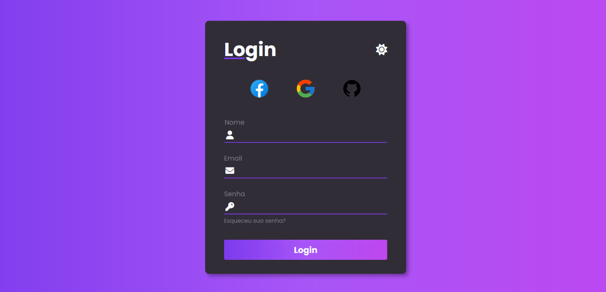

## Formulário com os temas DARK e LIGHT
### Fontes
- [Formulário com Modo DARK e LIGHT | HTML, CSS (com FLEXBOX) e JS | #1](https://youtu.be/qKWApkuhNu8?si=EpxIqEYkOvR_fZ8z)  
- [Icons8](https://icons8.com)  

### Screenshot

